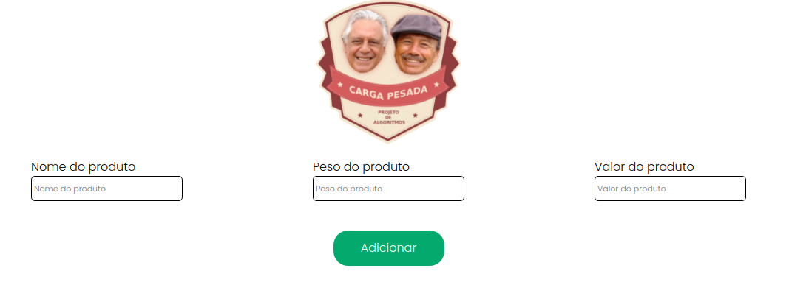
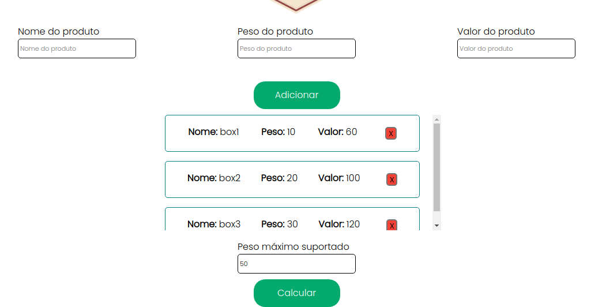
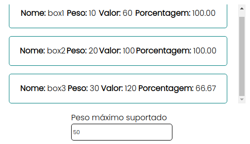

# Greed_Carga_Pesada

**Número da Lista**: X 
**Conteúdo da Disciplina**: Greed 

## Alunos
|Matrícula | Aluno |
| -- | -- |
| 18/0106970  |  Matheus Gabriel Alves Rodrigues |
| 18/0129287 |  Pedro Henrique Vieira Lima |

## Sobre 
Sistema criado para ajudar Pedro e Bino a escolher a maior quantidade de carga disponivel de maneira com que eles consigam lucrar o maximo possivel.

## Screenshots

### Screenshot 1

### Screenshot 2

### Screenshot 3

## Instalação 
**Linguagem**: xxxxxx 
**Framework**: (caso exista) 
Descreva os pré-requisitos para rodar o seu projeto e os comandos necessários.

## Uso 
Explique como usar seu projeto caso haja algum passo a passo após o comando de execução.

## Outros 
Quaisquer outras informações sobre seu projeto podem ser descritas abaixo.

